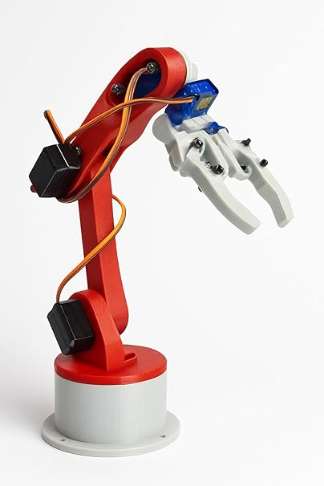
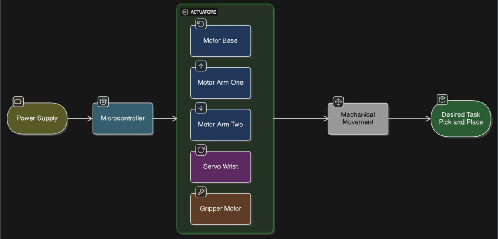
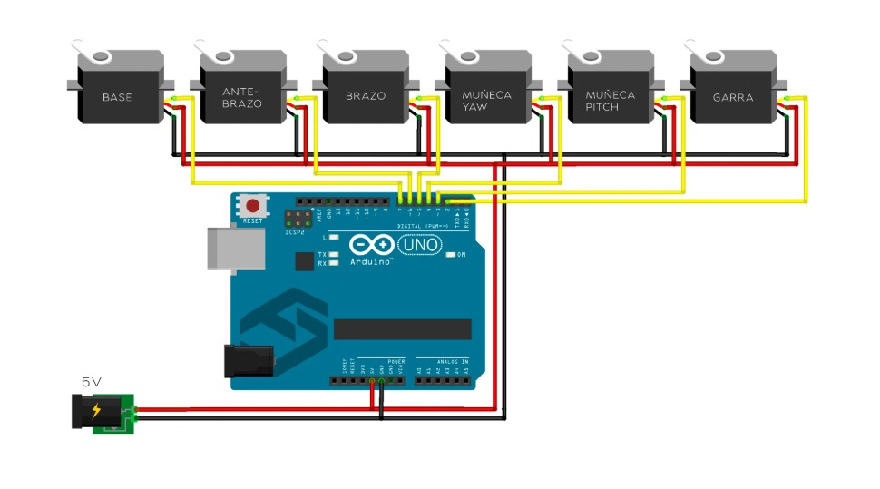

# Pick and Place Robotic Arm

## 🤖 Project Summary

This project is a 4-axis robotic arm designed for automated "Pick and Place" tasks. It uses an Arduino microcontroller and software  to control four servo motors: one for the base, two for the arm segments, and one for the gripper. The system is powered by an external 5V power supply to ensure stable movement.

## ⚙️ Hardware & Software Requirements

### Hardware
* **Microcontroller:** 1x Arduino Uno
* **Actuators:** 4x Servo Motors
    * 1x SG90 (or MG996R) for Base
    * 2x MG996R (or similar high-torque) for Arm/Shoulder
    * 1x SG90 for Gripper
* **Power Supply:** 1x External 5V 2A (or higher) DC Power Supply
* **Misc:**
    * Breadboard
    * Jumper Wires
    * Robotic Arm Kit (as pictured)

### Software
* **IDE:** Arduino IDE or VS Code with PlatformIO
* **Libraries:**
    * `Servo.h` (comes pre-installed with the Arduino IDE)
* Arm contol software

## 🔧 Setup Instructions

1.  **Assemble Hardware:** Build the robotic arm kit according to its manual.
2.  **Connect Electronics:** Wire the components as shown in the **Connection Diagram** section below. **Warning:** Do NOT power the servos directly from the Arduino's 5V pin. This will damage the Arduino. You MUST use an external 5V power supply.
3.  **Upload Code:**
    * Clone this repository.
    * Open the `software/main_code/main_code.ino` file in your Arduino IDE.
    * Select "Arduino Uno" as your board and the correct COM port.
    * Upload the sketch.
4.  **Test:** The arm will move to its "home" position and then begin its automated pick-and-place sequence.

## 📸 Project Image

(This is the `61KNgjbdupL._SY606_.jpg` you provided. It should be saved in the `docs/diagrams/` folder.)

## 🧩 Block Diagram Image

(This is the diagram from your previous upload.)

##Project Connection

**Software**
(https://drive.google.com/drive/folders/155aWvKH5jcQ96tFvs-LeDclDERoTMNEt)

## 📄 Paper or Report Link

For a detailed explanation of the project, including design choices, kinematics, and results, please see the full report.

[**Read the Full Project Report (PDF)**](Docs/report.pdf)
